# StegIMG

This application allows to hide arbitrary data into bitmaps by simple steganography algorithm.  
The main idea of the algorithm is based on using lower bits of some components in RGBA to store of hidden data.  
`[A][R][G][B]` -- pixel presented in RGBA color space.  
In this scheme each byte D of input data is decomposed into four part, two bits each.  
Each part written to lower bits of R and/or B bytes.  
Here we use R and B parts only, because it allows to doesn't much spoil input image.  

## User Guide

The main window at the time of starting the program:

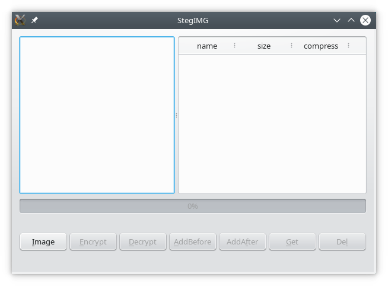

The button `Image` opens dialog to load of a base image.
If this step finished with error, you will see the next message:

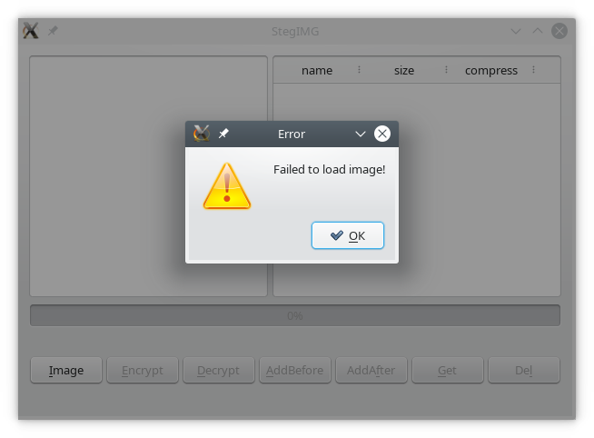

Otherwise, you will get extended options:

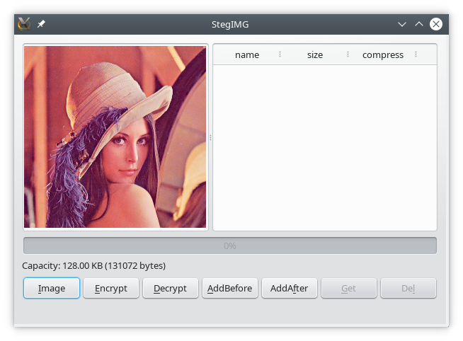

The status bar displays capacity of the steganographic container.

The buttons `AddBefore` and `AddAfter` allow to add new
contents into archive.
Following choise of the file in corresponding dialog
you will see window with available options:

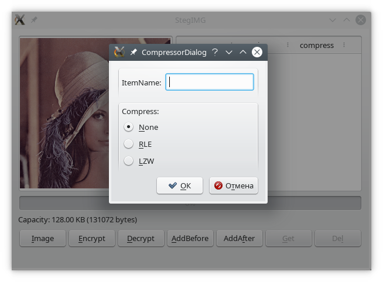

Here `ItemName` is a name of the file into archive.
It must not longer than 255 characters!

You also can choose one of the available compression methods:  
`None` -- without compression;  
`RLE` -- run-length encoding (for uniform strings);  
`LZW` -- Lempel-Ziv-Welch.

There are some possible errors here:

It may be caused by not conforming file permissions or corrupted of the file system.

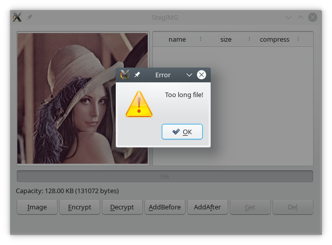

This message means that capacity of the container exceeded.

After adding the files into archive:

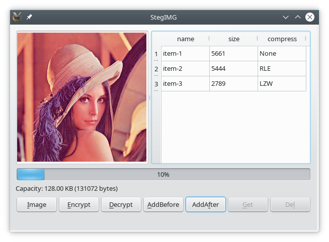

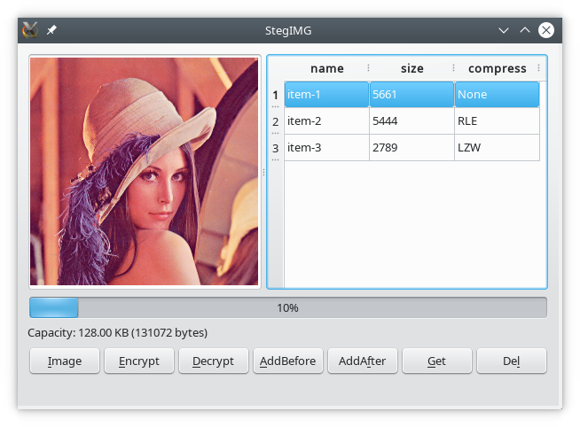

The progress bar displays bussy space volume in percent of available capacity.

The table contains list of properties of the each item.

The table also supports a feature to rename items:

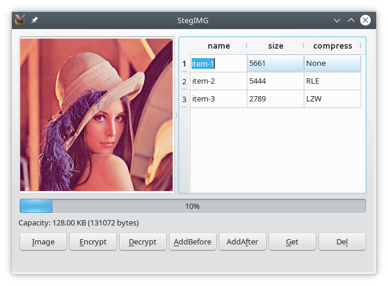

But this operation can throw error if name is longer than 255 or
resulted file header does not fit into container:

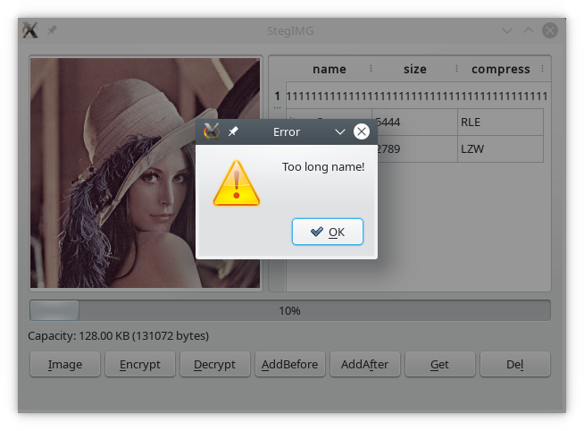

The button `Del` is responsible to remove items from archive.
The button `Get` allows to extract item to external file.

The button `Encrypt` saves container into a bitmap image.
But only 'bmp' and 'png' formats are supported.

You also can set own password to a secure encryption:

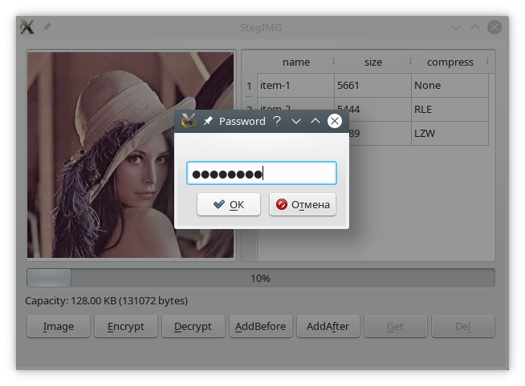

Further, when opening the container, you can decrypt its content by same password  
(the button `Decrypt` opens a corresponding dialog).

In this case if your password is false, you can get corresponding message:

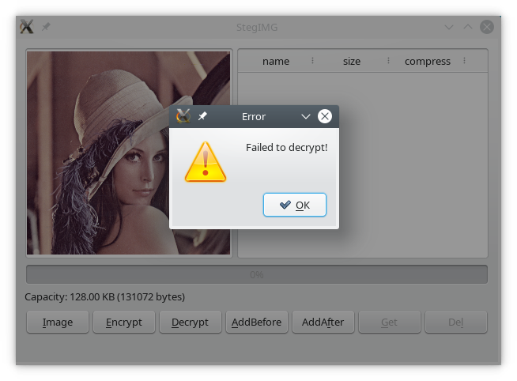

But it is also possible that the container will be unpacked incorrectly.
